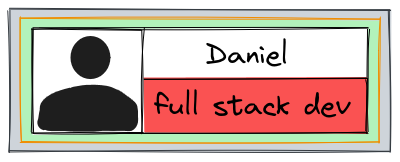

<h1 align="center">Hi 👋, I'm Daniel</h1>
<h3 align="center">A passionate fullstack developer</h3>

  

<h3 align="left">Connect with me:</h3>

<h3 align="left">Languages and Tools:</h3>

                                  

&nbsp;

